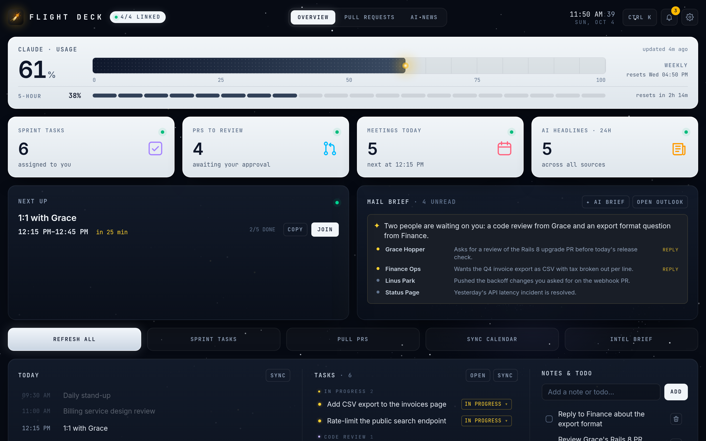
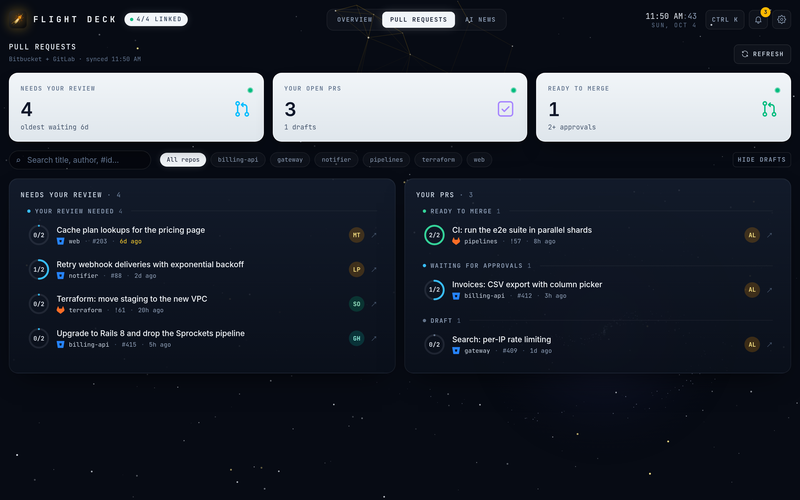
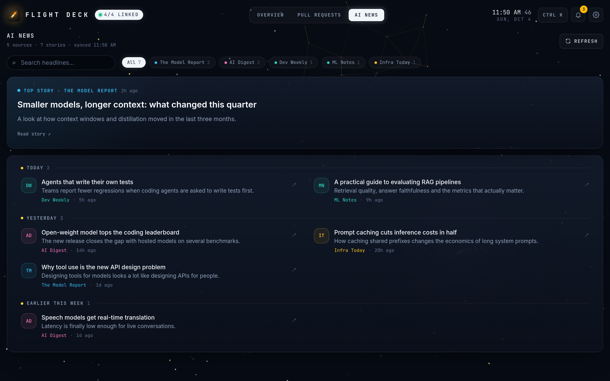
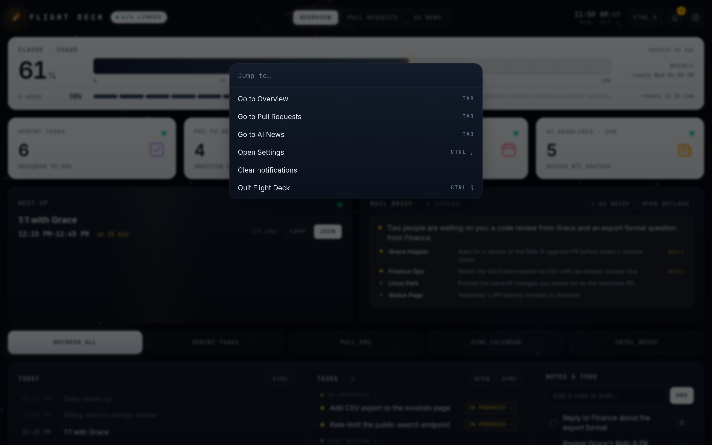
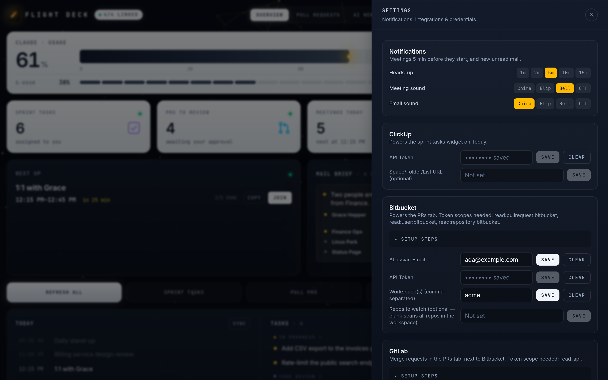

# Flight Deck

A "start of day" desktop dashboard for developers. One window shows your sprint
tasks, open pull requests, today's meetings, an AI brief of your unread mail,
Claude usage limits and AI news, and it sends native reminders before meetings.

Built with Tauri 2 (Rust) + React 19 + TypeScript + Vite + Tailwind. Linux is
the main target (tested on GNOME).



<table>
  <tr>
    <td></td>
    <td></td>
  </tr>
  <tr>
    <td></td>
    <td></td>
  </tr>
</table>

<sub>Screenshots use the built-in demo mode with made-up data (see Development).</sub>

## Features

- **Overview**: Claude weekly / 5-hour usage, stat tiles, next meeting with a
  countdown, an AI mail brief, today's schedule, ClickUp tasks (with a status
  picker), a local todo list and AI headlines.
- **Pull Requests**: Bitbucket PRs and GitLab merge requests you authored or
  need to review, in one list.
- **AI News**: a feed of AI blogs and news sites.
- **Meeting reminders**: native notifications a configurable number of minutes
  before each meeting, with a Join button.
- **Mail notifications**: new unread Outlook mail shows up as a notification.
- **Keyboard**: `Ctrl+K` command palette, `Ctrl+,` settings,
  `Ctrl+Shift+Space` show/hide the window, `Ctrl+Q` quit.

Every integration is optional. Link the ones you use in Settings (gear icon).

## Requirements

- Linux with a desktop session (GNOME recommended), X11 or XWayland
- A Secret Service keyring (gnome-keyring or KWallet) for storing tokens
- A notification daemon (any modern desktop has one)

## Install

Download a prebuilt package from the
[latest release](https://github.com/IrakliSlivin/flight-deck/releases/latest).
There's nothing to compile.

### Ubuntu / Debian

```bash
wget https://github.com/IrakliSlivin/flight-deck/releases/latest/download/flight-deck_amd64.deb
```

```bash
sudo apt install ./flight-deck_amd64.deb
```

apt installs the libraries it needs. Then open **Flight Deck** from your app
menu. To update, run the same two commands again. To uninstall:

```bash
sudo apt remove flight-deck
```

### Other distros (AppImage)

```bash
wget https://github.com/IrakliSlivin/flight-deck/releases/latest/download/flight-deck_amd64.AppImage
```

```bash
chmod +x flight-deck_amd64.AppImage
```

```bash
./flight-deck_amd64.AppImage
```

If it says FUSE is missing, install `libfuse2` (on Ubuntu 24.04 and newer:
`libfuse2t64`).

### macOS

Download
[flight-deck_universal.dmg](https://github.com/IrakliSlivin/flight-deck/releases/latest/download/flight-deck_universal.dmg)
(Apple Silicon and Intel, macOS 11+), open it and drag **Flight Deck** into
Applications.

The app isn't notarized by Apple, so the first launch says it can't be
verified. Either open System Settings → Privacy & Security and click
**Open Anyway**, or run once:

```bash
xattr -cr "/Applications/Flight Deck.app"
```

On macOS the Outlook window may flash briefly while it loads the inbox, and
notification sounds use the built-in system sounds.

### Switching from a source install

If you installed with `scripts/install-desktop.sh` before, remove that copy
so the app menu doesn't show Flight Deck twice:

```bash
rm -f ~/.local/bin/flight-deck ~/.local/share/applications/flight-deck.desktop
```

## Build from source

For contributors, or if you'd rather build it yourself. The first build takes
several minutes. These steps are for Debian/Ubuntu; for other distros, see the
[Tauri prerequisites](https://v2.tauri.app/start/prerequisites/) and install the
equivalent packages.

Run every step in a regular system terminal, not the terminal inside an editor
installed as a snap or Flatpak (see [Troubleshooting](#troubleshooting)).

### 1. System packages

Refresh the package index first, otherwise apt may try to download versions
that have been removed from the mirror and fail with `404 Not Found`:

```bash
sudo apt update
```

```bash
sudo apt install build-essential curl wget file pkg-config libssl-dev libxdo-dev libdbus-1-dev libglib2.0-dev libgtk-3-dev libsoup-3.0-dev libjavascriptcoregtk-4.1-dev libwebkit2gtk-4.1-dev libayatana-appindicator3-dev librsvg2-dev
```

### 2. Rust

```bash
curl --proto '=https' --tlsv1.2 -sSf https://sh.rustup.rs | sh
```

Accept the default option (1), then load it into the current terminal (or open
a new one) and check it:

```bash
source "$HOME/.cargo/env"
```

```bash
cargo --version
```

### 3. Node.js 20

Any way of installing Node 20 works (the repo has an `.nvmrc`). With
[nvm](https://github.com/nvm-sh/nvm):

```bash
nvm install 20
```

### 4. Build and install

```bash
git clone https://github.com/IrakliSlivin/flight-deck.git
cd flight-deck
npm install
npx tauri build --no-bundle
./scripts/install-desktop.sh
```

This installs `~/.local/bin/flight-deck` and a "Flight Deck" entry in your app
menu (no sudo). To update later, run `git pull`, `npm install`, then the last
two commands again.

If you'd rather have a package, `npm run tauri build` produces `.deb`, `.rpm`
and `.AppImage` files in `src-tauri/target/release/bundle/`.

### Troubleshooting

| Error | Fix |
|---|---|
| apt: `Failed to fetch ... 404 Not Found` | The package index is out of date. Run `sudo apt update`, then the install again. If it still fails, the mirror may be mid-sync: wait and retry, or run `sudo apt clean && sudo apt update` first. |
| `failed to run 'cargo metadata' ... No such file or directory` | Rust isn't installed, or this terminal doesn't have it on `PATH`. Do step 2, or run `source "$HOME/.cargo/env"`. |
| `install-desktop.sh`: `Build first: npx tauri build --no-bundle` | The build in step 4 didn't finish. Scroll up to its first error. |
| `The system library 'glib-2.0' (or 'dbus-1', 'gtk+-3.0', ...) required by crate ... was not found` | A `-dev` package is missing, usually because the step 1 install stopped early. Run step 1 again and check its output. The table below lists which package provides which library. |
| The same "not found" error even though `pkg-config` finds the library in your terminal | The build is running somewhere that can't see system libraries. Usually that's the terminal of an editor installed as a snap or Flatpak (for example VS Code from the Snap Store). Build in a regular terminal. As a one-off workaround: `PKG_CONFIG_PATH=/usr/lib/x86_64-linux-gnu/pkgconfig:/usr/share/pkgconfig npx tauri build --no-bundle`. |

| Library in the error | Package |
|---|---|
| `glib-2.0` | `libglib2.0-dev` |
| `gtk+-3.0`, `gdk-3.0` | `libgtk-3-dev` |
| `dbus-1` | `libdbus-1-dev` |
| `libsoup-3.0` | `libsoup-3.0-dev` |
| `javascriptcoregtk-4.1` | `libjavascriptcoregtk-4.1-dev` |
| `webkit2gtk-4.1` | `libwebkit2gtk-4.1-dev` |
| `openssl` | `libssl-dev` |

## Setting up integrations

Open Settings (gear icon or `Ctrl+,`). Tokens are saved in your OS keyring,
never in a file, and every request goes straight from your machine to the
service.

| Integration | What you need |
|---|---|
| **ClickUp** | A personal API token (ClickUp → Settings → Apps → API Token). After it connects you can pick a space, folder or list to narrow the tasks. |
| **Bitbucket** | Your Atlassian email and an [Atlassian API token with scopes](https://id.atlassian.com/manage-profile/security/api-tokens): choose **"Create API token with scopes"**, pick the **Bitbucket** app, and check `read:pullrequest:bitbucket`, `read:user:bitbucket`, `read:repository:bitbucket` and `read:workspace:bitbucket`. After it connects you pick the workspace and repos from lists (without `read:workspace` you type the workspace slug). |
| **GitLab** | A [personal access token](https://gitlab.com/-/user_settings/personal_access_tokens) with the `read_api` scope. Set the GitLab URL (under "Self-hosted GitLab?") if it's self-hosted. |
| **Outlook Calendar** | A published ICS link: Outlook on the web → Settings → Calendar → Shared calendars → Publish a calendar → "Can view all details" → copy the **ICS** link. |

The Settings drawer shows these steps next to each integration. **Save & connect** checks the credentials right away and shows who you're connected as.

### Optional extras

- **Outlook mail** (notifications and the mail brief): there is no API setup.
  The app opens Outlook on the web in a hidden window. Click **Open Outlook**
  on the Mail brief card, sign in once and leave it on the Inbox (`Ctrl+W`
  hides it again). It reads your inbox page, so a
  big change to Outlook's web markup can break it.
- **AI mail brief**: needs [Claude Code](https://claude.com/claude-code)
  installed and logged in (`claude` on your PATH or in `~/.local/bin`). The
  unread messages are sent to Claude using your own Claude Code login.
- **Claude usage tile**: reads Claude Code's local data in `~/.claude`. It
  shows nothing if you don't use Claude Code.

## Privacy

- Tokens and the calendar link are stored in your OS keyring.
- Todos and settings are stored locally (SQLite and JSON in the app data
  folder).
- Nothing is sent to any server run by this project. Data only goes to the
  services you link (ClickUp, Bitbucket, GitLab, Outlook) and, for the mail
  brief, to Claude through your own Claude Code account.

## Development

```bash
npm install
npm run dev:app      # tauri dev with file polling (recommended)
npm run build        # type-check + build the frontend
```

### Demo mode

```bash
npm run demo         # http://localhost:1430
```

Runs the UI in a normal browser with made-up data and no tokens. `VITE_DEMO=1`
points the `@tauri-apps/*` imports at mocks in `src/demo/`, so the app code is
unchanged and real builds never include them. It's useful for UI work and for
the screenshots in `docs/screenshots/`. Edit `src/demo/data.ts` to change what
it shows.

`dev:app` makes Vite poll for file changes instead of using inotify, which
avoids `ENOSPC` crashes on machines with a low inotify watch limit. Plain
`npm run tauri dev` works too.

All network calls happen in Rust (`src-tauri/src`, one module per
integration). The React app calls them through small wrappers in `src/lib`.
New Tauri commands must be added to `src-tauri/build.rs` and
`src-tauri/capabilities/default.json`.

## License

[MIT](LICENSE)
